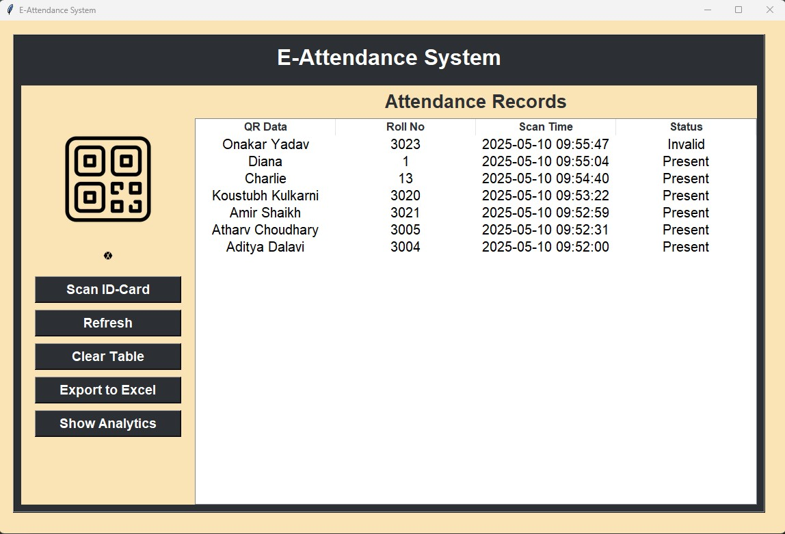

# 📌 E-Attendance System using QR Code, Tkinter, SQLite, and OpenCV

This project is a QR-based E-Attendance System built with Python. It uses QR codes to mark student attendance in a secure, efficient, and automated manner. The system features a user-friendly GUI, real-time QR code scanning, anomaly detection, and attendance analytics.

## 🔧 Key Features
- QR Code Scanning: Real-time QR code scanning using the webcam and Pyzbar.

- GUI Interface: Built with Tkinter for managing attendance, scanning, exporting, and analytics.

- SQLite Database: Stores student records and attendance logs locally.

- Anomaly Detection: Flags abnormal scan patterns using an Isolation Forest model.

- Excel Export: Exports attendance data to Excel (.xlsx) for easy sharing and reporting.

- Attendance Analytics: Visualizes attendance trends over time with matplotlib.

## 🗃️ Data Flow
- QR codes contain student info in the format: Name - RollNo.

- When scanned, the system verifies the QR data against the database.

- Attendance is logged with a timestamp and status (Present/Invalid).

- Duplicate scans are ignored during a single session.

- Admin can refresh data, clear records, export logs, and view analytics.

## 🛠️ Technologies Used

- Python

- Tkinter (GUI)

- OpenCV + Pyzbar (QR Code scanning)

- SQLite (Database)

- Pandas, Matplotlib (Data handling & visualization)

- Scikit-learn (Anomaly detection)

## 📷 Gui:

## 📷 Analytics Chart:

